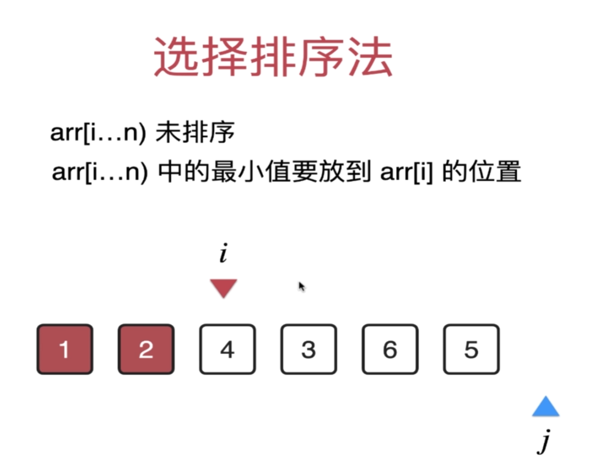

# 第一章总结

## 线性查找

在算法体系课中，作者用线性查找算法介绍了算法设计的基本流程。

- 某种具体数据类型实现；
- 泛型实现；
- 分析时间复杂度（测试算法性能）。

重要概念：

- 循环不变量；
- 时间复杂度的概念；

在每一次循环的时候都要保持一种性质，而这种性质指的就是循环不变量。

以下是线性查找算法的代码：

```Java
public static <E> int search(E[] data, E target){
  for (int i=0; i<data.length; i++) {
    if(data[i].equals(target)){
        return i;
    }
  }
  return -1;
}
```

在线性查找这个算法中，循环不变量是：

- 确认 `data[i]` 是不是目标；
- `data[0...i)` 中没有找到目标。

### 循环不变量

循环体的作用维持循环不变量。

分析循环不变量的目的是帮我们搞清楚循环具体在做什么，换句话说**我们在写 `for` 循环的时候要清楚明白的知道这层 `for` 循环的时候在干什么**。

当我们能够清晰地描述循环不变量的时候，就能够更加清晰的写出 `for` 循环的代码，因为循环体的目的就是维持循环不变量。

在实现算法的过程中总是免不了循环，有时候写着写着就忘记了使用循环的目的，故想要写出正确的代码：

- 需要定义循环不变量；
- 维护循环不变量；

循环不变量帮助我们维护一个正确的循环，除此之外，还需维护一个正确的函数。对于函数来说，一定要定义清楚函数的功能，即要清晰的定义函数的输入与输出。以线性查找算法中的 `search` 函数来说：

- 输入：数组，目标元素。
- 输出：如果存在，就返回目标元素所在的索引；如果不存在，则返回 -1。

### 复杂度分析

复杂度分析：表示算法的性能。

- 通常看最差的情况；
- 算法运行的上界；
- 常数不重要。

O(n) 表示算法的性能和数据规模 n 成正比的关系。

**复杂度描述的是随着数据规模 n 的增大，算法性能的变化趋势**。

常见的时间复杂度以对应的例子：

- 遍历二维数组：`O(n^2)` 平方级别；
- 数字转二进制：`O(logn)` 对数级别；
- 求数字 `n` 的约数：`O(n^1/2)` 平方根级别；
- 长度为 `n` 的二进制数字：`O(2^n)` 指数级别；
- 长度为 `n` 的数组的所有排列：`O(n!)` 阶乘级别；
- 判断数字 `n` 是否为偶数：`O(1)` 。

常见算法复杂度排序：

`O(1)` < `O(logn)` < `O(n^1/2)` < `O(n)` < `O(nlogn)` < `O(n^2)` < `O(n!)` 。

## 选择排序

选择排序算法的基本思路：


循环不变量：

- arr[i...n)未排序；
- arr[0,i)已排序

如何实现 `arr[0,i)` 已排序？

找到 `arr[i...n)` 中最小的元素，随后把最小的元素和 `arr[i]` 交换位置。

```PHP
public static function sort(array $arr){
    for ($i = 0; $i < count($arr); $i++) {
        // 用于保存 arr[i...n) 中最小的元素对应的索引
        $minIndex = $i;
        for ($j = $i; $j < count($arr); $j++) {
            if ($arr[$j] < $arr[$minIndex]) {
                $minIndex = $j;
            }
        }
        $t = $arr[$minIndex];
        $arr[$minIndex] = $arr[$i];
        $arr[$i] = $t;
    }
    return $arr;
}
```

流程：

- 用某种具体的数据类型实现；
- 泛型实现；
- 校验算法的正确性；
- 时间复杂度分析。
