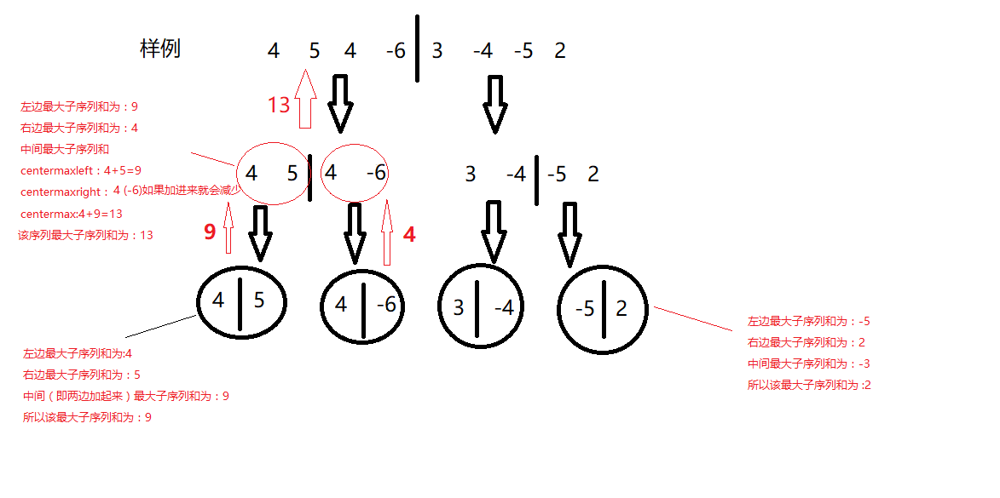
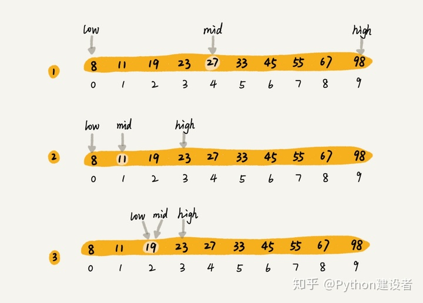

### 分治思想
#### 定义。
- 描述1：分治算法的基本思想是将一个规模为N的问题分解为K个规模较小的子问题，这些子问题相互独立且与原问题性质相同。求出子问题的解，就可得到原问题的解。即一种分目标完成程序算法，简单问题可用二分法完成。
#### 理解。
- 把大问题拆分成小问题，再挨个解决小问题，小问题的解合起来就是大问题的解。（当然这些小问题要相互独立并且与大问题的性质相同）
#### 关键字。
- 分解问题。
- 相互独立、性质相同。
- 分而治之，最后合并。
#### 例子：

- 1、最大子段和。
  - 
  - 思路：
    - 假定a[1]-a[n]的序列对应的区间[l...r],其中间位置为mid,其最大和的子序列为[i...j]
    那么显然，最大连续子序列的位置只有三种可能
      - 1、完全处于序列的左半：1<=i<=j<=mid
      - 2、跨越序列中间：i<=mid<=j<=r
      - 3、完全处于序列的右半：mid<i<=j<=r
  - 步骤：
    - 1、计算第二种跨越mid情况的序列的最大和。
    - 2、情况1和情况3用递归求解。
    - 3、比较方式1、2、3的最大值。
- 2、快速排序。
  - 
  - 思路：把大的元素数值放到一个临时数组里，把小的元素数值放到另一个临时数组里。
  - 步骤：
    - 用一个数组的第一个元素分割这个数组，这个元素记作$mid；
    - 把数组中小于$mid的元素放在左边；
    - 把数组中大于$mid的元素放在右边；
    - 合并左边，中间，右边 三个数组；
- 3、二分查找。
  - 
  - 思路：以数组中某个值为界，再递归进行查找，直到结束。
    - 确定要查找的区间
    - 确定要二分时的参照点
    - 区间内选取二分点
    - 根据二分点的值，综合左右区间情况以及求解的目的，舍去一半无用的区间
    - 继续在有效区间重复上面的步骤

#### 基本步骤。
- 拆分。
  - 将要解决的问题划分成若干规模较小的同类问题；
- 求解。
  - 当子问题划分得足够小时，用较简单的方法解决；
- 合并。
  - 按原问题的要求，将子问题的解逐层合并构成原问题的解。