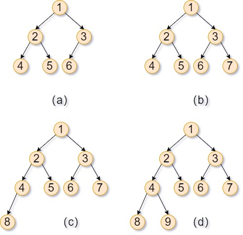
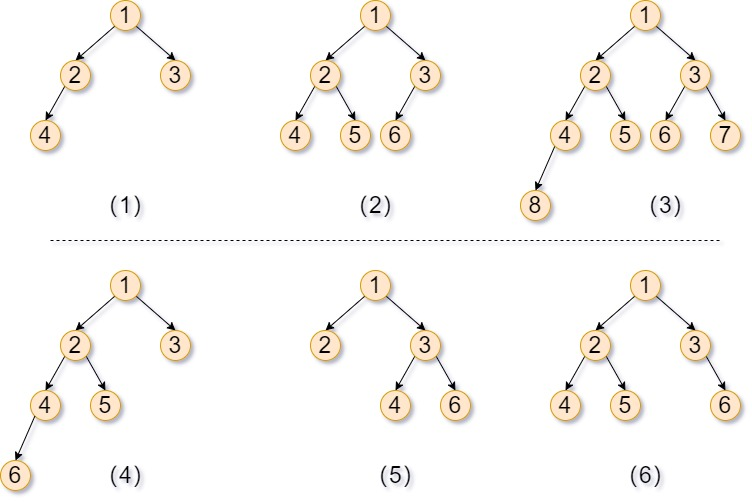
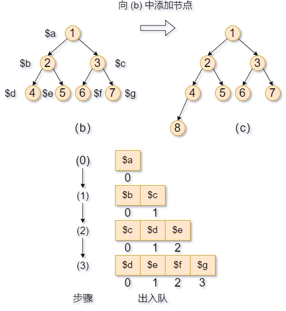

### 在完全二叉树中添加子节点
#### 问题描述[^1]
完全二叉树是每一层（除最后一层外）都是完全填充（即，节点数达到最大）的，并且所有的节点都尽可能地集中在左侧。

例如：图1 中的 4 棵二叉树均为完全二叉树。实现数据结构 CBTInserter 有如下三种方法：
- CBTInserter(Node root) 使用头节点为 root 的给定树初始化该数据结构; 
- CBTInserter->insert(val) 向树中插入一个新节点，节点类型为 TreeNode，值为 val 。使树保持完全二叉树的状态，并返回插入的新节点的父节点的值；
- CBTInserter.get_root() 将返回树的头节点。


<center style="font-size:14px;color:#C0C0C0;text-decoration:underline">图1</center>

说明：在 (a) 中的完全二叉树中添加节点 7 得到 (b)；在 (b) 中的完全二叉树中添加节点 8 得到 (c)；在 (c) 中的完全二叉树中添加节点 9 得到 (d)。
#### 什么是完全二叉树？
在读完题之后，写代码之前需要先搞明白什么是完全二叉树？
> 完全二叉树是由满二叉树而引出来的，若设二叉树的深度为h，除第 h 层外，其它各层 (1～h-1) 的结点数都达到最大个数(即1~h-1层为一个满二叉树)，第 h 层所有的结点都连续集中在最左边，这就是完全二叉树[^2]。

总结：
对于一个深度为 h 的二叉树必须满足以下条件才是完全二叉树：
1. 1~h-1 层是满二叉树（国内的满二叉树[^3]）。
2. h 层的所有节点都连续集中在最左边。

文字描述有点抽象，看几个例子就明白了。

<center style="font-size:14px;color:#C0C0C0;text-decoration:underline">图2</center> 
图中的(1)(2)(3)都是完全二叉树，而(4)(5)(6)都不是完全二叉树。

(1)(2)(3)是完全二叉树，那肯定符合完全二叉树的定义。那(4)(5)(6)为什么不是呢？我们一个一个来分析：
- (4)是一个深度为 4 的二叉树，1~2 层是满二叉树，**但第三层不是**。不满足 1~4-1 层是一个满二叉树的条件。
- (5)和(6)都是深度为 3 的二叉树，1~2 层是一个满二叉树，但是 第 3 层的所有节点**并非连续集中在最左边**。(5)的第三层最左边都没有节点，而(6)的第三层的所有节点不连续。

#### 问题分析
解决这个问题的关键在于理解完全二叉树的特点及在二叉树添加节点的顺序。
###### 完全二叉树特点：
1. 1~h-1 层是满二叉树，h 层最多有 2<sup>h-1</sup>个节点。
2. h 层的所有节点都连续集中在最左边。
###### 添加顺序：
1. 如果最底层节点的个数小于2<sup>h-1</sup>个，则从左到右找到该层第一个空缺位置并添加新的节点。
例如，向图(1)中的 (c) 添加节点：
%20中添加节点.jpg)
<center style="font-size:14px;color:#C0C0C0;text-decoration:underline">图3</center> 

2. 如果最底层节点的个数为2<sup>h-1</sup>，此时再向二叉树添加新的节点会在二叉树中添加新的一层，而且新的节点是新的一层最左边的节点，也就是说，新节点的父节点是原来最下面一层的最左边的节点。
例如，向图(1)中的 (b) 添加节点：
%20中添加节点.jpg)
<center style="font-size:14px;color:#C0C0C0;text-decoration:underline">图4</center> 

在完全二叉树中添加新节点的顺序看起来是从上至下，按层从左至右添加的，这就是典型的二叉树广度优先搜索的顺序。

###### 解题思路
1. 在完全二叉树中按照广度优先搜索的顺序找出第一个左子节点或右子节点还有空缺的节点。
2. 如果该节点没有左子节点，那么新的节点就作为该节点的左子节点；如果该节点没有右子节点，那么新的节点就作为该节点的右子节点。


#### 完整代码：
```
<?php
class GBTInserter{
	private $queue = [];
	private $root;
	public function __construct($root){
		// 利用广度优先搜索找到第一个缺少子节点的节点
		$this->root = $root;
		array_push($this->queue,$root);
		while($this->queuePeek($this->queue)->left != null && $this->queuePeek($this->queue)->right != null){
			$node = array_shift($this->queue);
			array_push($this->queue,$node->left);
			array_push($this->queue,$node->right);
		}
	} 
	public function queuePeek($queue){
		// 辅助函数，用于返回队列中的第一个元素。
		return $queue[0];
	} 
	public function insert($val){
		// 添加子节点的逻辑
		$parent = $this->queuePeek($this->queue);
		$node = new Node($val);
		if($parent->left == null){
			$parent->left = $node;
		}else{
			$parent->right = $node;
			array_shift($this->queue);
			array_push($this->queue,$parent->left);
			array_push($this->queue,$parent->right);
		}
		return $parent->data;
	}
	public function getRoot(){
		return $this->root;
	}
}
// 创建二叉树的类
class Node{
	public $left = NULL;
	public $right = NULL;
	public $data = '';
	public function __construct($data){
		$this->data = $data;
	}
	public function buildTree(Node $lchild = NULL,Node $rchild = NULL){
		if(!is_null($lchild)){
			$this->left = $lchild;
		}
		if(!is_null($rchild)){
			$this->right = $rchild;
		}
	}
}
// 创建完全二叉树
$a = new Node(1);
$b = new Node(2);
$c = new Node(3);
$d = new Node(4);
$e = new Node(5);
$f = new Node(6);
$a->buildTree($b,$c);
$b->buildTree($d,$e);
$c->buildTree($f);
$GBTInserter = new GBTInserter($a);
// 添加节点
$GBTInserter->insert(7);
$GBTInserter->insert(8);
$GBTInserter->insert(9);
$re = $GBTInserter->insert(10);
```
#### 模拟过程
以向图1中的 (b) 添加节点为例。
1. GBTInserter 类的构造方法中的广度优先搜索算法是如何找到第一个缺少子节点的节点的？

<center style="font-size:14px;color:#C0C0C0;text-decoration:underline">图5</center> 

①. 图5 步骤(0)，将完全二叉树的根节点添加到队列中。相关的代码如下：
②. 根节点 \$a 的左右子节点都不为空，于是 \$a 出队，将 \$a 的左右子节点依次入队，如图5 步骤(1)所示。相关代码如下：
``` 
public function __construct($root){
   // 将完全二叉树的根节点添加到队列中
   array_push($this->queue,$root);
   // 队首的节点的左右子节点都不为空时，继续执行。
   while($this->queuePeek($this->queue)->left != null && $this->queuePeek($this->queue)->right != null){
      $node = array_shift($this->queue);
      array_push($this->queue,$node->left);
      array_push($this->queue,$node->right);
   }
}
```
③. 接下来就是循环处理 \$b 、\$c 节点。由于 \$b 、\$c 节点的左右子节点都不为空，所以过程和处理 \$a 节点类似，如图5 步骤(2)、步骤(3)所示。
④. 经过步骤(3)之后，队列中保存的全是第 3 层的节点。而队首节点 \$d 没有子节点，循环终止。**即第一个缺少子节点的节点就保存在队列的队首。**
   
1. GBTInserter 类的 insert() 方法是如何添加子节点的：
在实例化 GBTInserter 类之后，队列中存储的都是缺少子节点的节点：
```
$queue = [$d,$e,$f,$g]
```
而队首的节点就是第一个缺少子节点的节点。而我们正是要向该节点添加子节点。
①. 利用 queuePeek 方法获取队首节点。
②. 实例化需要添加的节点。
```
public function insert($val){
   ...
   $parent = $this->queuePeek($this->queue);
   $node = new Node($val);
   ...
}
```

③. 先问队首节点是否有左子节点？如果没有则添加至左子节点，否则添加到右子节点，并且并且队列`出一入二`。
	- 出一是指将队首的节点出队，该节点在添加右子节点之后已经不再缺少子节点了，而队列记录的是缺少子节点的节点，自然需要将其出队。
	- 入二是指将队首节点的左右子节点入队。


④. 返回队首节点的值。
```
public function insert($val){
   ...
   if($parent->left == null){
   	$parent->left = $node;
   }else{
   	$parent->right = $node;
   	array_shift($this->queue);
   	array_push($this->queue,$parent->left);
   	array_push($this->queue,$parent->right);
   }
   return $parent->data;
}
```

#### 复杂度分析
1. 时间复杂度：
   - GBTInserter 的构造函数从本质上来说是按照广度优先搜索的顺序找出二叉树中所有既有左子节点又有又子节点的节点，因此时间复杂度为 O(n)。
   - 调用函数 insert 在完全二叉树中添加一个节点最多只需要在队列中删除一个节点并添加两个节点。通常，队列的插入、删除的时间复杂度都是 O(1)。
2. GBTInserter 类需要一个队列来实现广度优先搜索算法保存缺少左子节点或右子节点的节点，空间复杂度为 O(n)。

[^1]:《剑指offer》
[^2]:[常见数据结构——完全二叉树（定义、特征、节点个数的判断以及C++简单实现）](https://blog.csdn.net/JMW1407/article/details/108204019)
[^3]:[满二叉树](https://blog.csdn.net/u010029439/article/details/114548089)
[^4]:[完全二叉树看起来并不完全，为什么叫完全二叉树呢？](https://zhuanlan.zhihu.com/p/153216919)
1. [英文定义](https://www.programiz.com/dsa/complete-binary-tree#:~:text=A%20complete%20binary%20tree%20is%20a%20binary%20tree,the%20leaf%20elements%20must%20lean%20towards%20the%20left.)
