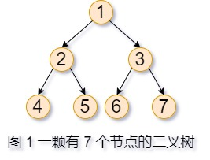

### 二叉树的深度优先搜索
#### 一、树的基础知识
###### （一）树的基本结构
> 在二叉树中的每个节点最多只有两个子节点，可以分别把它们称为左子节点和右子节点。二叉树的根节点没有父节点，一颗非空二叉树只有一个父节点。二叉树的叶节点没有子节点。

名词说明：
叶节点：如果一个节点没有子节点，那么它是一个叶节点。例如在图 1 的二叉树中，节点 4、节点 5、节点 6、节点 7 都没有子节点，故节点 4、5、6、7 都是叶节点。


###### （二）二叉树的递归性质
> 二叉树是一种典型的具有递归性质的数据结构。二叉树的根节点可能有子节点，子节点又是对应子树的根节点，该节点可能也有自己的子节点。

例如图 1 中的节点 1 是该二叉树的根节点，节点 1 有左子节点 2、右子节点 3。而节点 2 是左子树的根节点，节点 2 也有子节点。

既然有递归性质，那么自然可以用递归来遍历二叉树。
###### （三）创建二叉树
定义二叉树数据结构
```
class Node{
	public $left  = NULL;
	public $right = NULL;
	public $data;
	public function __construct($data){
		$this->data = $data;
	}
}
```
#### 二、中序遍历
###### （一）什么是中序遍历？
> 先遍历二叉树的左子树，再遍历二叉树的根节点，最后遍历二叉树的右子树。

例如，如果中序遍历图 1 中的二叉树，则先后遍历节点 4、节点 2、节点 5、节点 1、节点 6、节点 3、节点 7。
###### （二）递归实现
（1）参考代码：
```
class Tree{
	public $nodes = [];
        // Node 类是前文的创造二叉树的 Node 类。
	public function inorderTraversal(Node $root){
		$this->dfs($root,$this->nodes);
		return $this->nodes;
	}
	public function dfs($root,$nodes){
		if($root != NULL){
			$this->dfs($root->left,$nodes);
			$this->nodes[] = $root->data;
			$this->dfs($root->right,$nodes);
		}
	}
}
```
（2）代码分析：
在我之前写的《递归十诫》几篇博客中，递归的对象是 `列表`。在递归二叉树时，也可以参考《递归十诫》。

① 第一诫：在递归 `列表` 时，将 `empty` 作为诸问题之首；根据二叉树的递归性质可以得出，在递归二叉树时，将 `根节点是否为空` 作为诸问题之首。其实也很好理解：当输入的是一个空二叉树时，就不能进行递归。
```
public function dfs($root,$nodes){
    if($root != NULL){
    ...
    }
}
```

② 第四诫：至少改变一个参数，该参数必须向着不断接近结束条件的方向而改变，改变的参数必须在结束时得以测试。在这里，主要改变的是根节点。将当前根节点的左右子节点作为下一次调用的根节点。
```
public function dfs($root,$nodes){
    ...
    $this->dfs($root->left,$nodes);
    ...
    $this->dfs($root->right,$nodes);
    ...
}
```
③ 先后顺序：根据中序遍历的顺序，应该先对左子树递归，再遍历根节点，最后对右子树递归。
###### （三）迭代实现
在用迭代实现之前，需要先搞明白这篇博客的主题——深度优先搜索。
（1）什么是深度优先搜索？
> 深度优先遍历（Depth First Search），简称DFS，其原则是，沿着一条路径一直找到最深的那个节点，当没有子节点的时候，返回上一级节点，寻找其另外的子节点，继续向下遍历，没有就向上返回一级，直到所有的节点都被遍历到，每个节点只能访问一次[^1]。

（2）参考代码：
```
class Tree{
	public $nodes = [];
	public $stack = [];
	public function inorderTraversal(Node $root){
		$cur = $root;
		while($cur != NULL || !empty($this->stack)){
			while($cur != NULL){
				array_push($this->stack,$cur);
				$cur = $cur->left;
			}
			$cur = array_pop($this->stack);
			array_push($this->nodes,$cur->data);
			$cur = $cur->right;
		}
		return $this->nodes;
	}
}
``` 
（3）代码分析：
① **顺着当前节点的左子节点的指针一路向左，直到遇到第一个缺少左子节点的节点 N，并将沿途遇到的节点存入栈中**。此时栈顶就是在一路向左的路上遇到的第一个缺少左子节点的节点 N。
```
public function inorderTraversal(Node $root)
{
	// 变量 cur 表示当前遍历的节点。
	$cur = $root;
	while ($cur != null || !empty($this->stack)) {
		while ($cur != null) {
			array_push($this->stack, $cur);
			$cur = $cur->left;
		}
		...
	}
	...
}
```
② 节点 N 出栈，保存节点 N 的值。
③ 将当前节点的值更新为节点 N 的右子节点。再次循环，②、③ 步骤代码如下：
```
public function inorderTraversal(Node $root)
{
	$cur = $root;
	while ($cur != null || !empty($this->stack)) {
		...
		$cur = array_pop($this->stack);
		array_push($this->nodes, $cur->data);
		$cur = $cur->right;
	}
	return $this->nodes;
}
```
总结：一直向左走到黑，直到遇到节点 N（第一个缺少左子节点的节点），左走不通了，再看看节点 N 的右边能不能走通：
- 如果能走通，就继续一路向左走。
- 如果走不通，返回节点 N 的根节点 R，再走向节点 R 的右边，然后继续往左走。

如此循环往复，直到遍历了所有节点。
#### 三、前序遍历
###### （一）什么是前序遍历？
> 先遍历二叉树的根节点，再遍历二叉树的左子树，最后遍历二叉树的右子树。

例如，如果前序遍历图 1 中的二叉树，则先后遍历节点 1、节点 2、节点 4、节点 5、节点 3、节点 6、节点 7。
###### （二）递归实现
前序遍历的递归代码实现和中序遍历的递归代码实现类似，只需要调整递归函数中代码的顺序即可。
```
class Tree{
	public $nodes = [];
	public function inorderTraversal(Node $root){
		$this->dfs($root,$this->nodes);
		return $this->nodes;
	}
	public function dfs($root,$nodes){
		if($root != NULL){
			$this->nodes[] = $root->data;
			$this->dfs($root->left,$nodes);
			$this->dfs($root->right,$nodes);
		}
	}
}
```
###### （三）迭代实现
前序遍历的迭代代码类似于中序遍历的迭代代码。

它们之间唯一的区别在于顺着左子节点的指针向下移动时，前序遍历将遍历遇到的每个节点添加到栈中。

这是由前序遍历的顺序决定的，前序遍历是先遍历根节点，再遍历它的左子节点。
```
class Tree{
	public $nodes = [];
	public $stack = [];
	public function preOrderTraversal(Node $root){
		$cur = $root;
		while($cur != NULL || !empty($this->stack)){
			while($cur != NULL){
				array_push($this->nodes,$cur->data);
				array_push($this->stack,$cur);
				$cur = $cur->left;
			}
			$cur = array_pop($this->stack);
			$cur = $cur->right;
		}
		return $this->nodes;
	}
}
```
#### 四、后序遍历
###### （一）什么是后序遍历？
> 先遍历二叉树的左子树，再遍历二叉树的右子树，最后遍历二叉树的根节点。

例如，如果前序遍历图 1 中的二叉树，则先后遍历节点 4、节点 5、节点 2、节点 6、节点 7、节点 3、节点 1。
###### （二）递归实现
后序遍历的递归代码实现和中序遍历的递归代码实现类似，只需要调整递归函数中代码的顺序即可。
```
class Tree{
	public $nodes = [];
	public function postOrderTraversal(Node $root){
		$this->dfs($root,$this->nodes);
		return $this->nodes;
	}
	public function dfs($root,$nodes){
		if($root != NULL){
			$this->dfs($root->left,$nodes);
			$this->dfs($root->right,$nodes);
			$this->nodes[] = $root->data;
		}
	}
}
```
###### （三）迭代实现
和中序遍历、前序遍历相比，后序遍历的迭代代码要稍微复杂一点。

当达到某个节点时：
- 如果之前还没遍历过它的右子树就得前往它的右子节点。
- 如果之前已经遍历过它的右子树那么就可以遍历这个节点。

也就是说，**此时要根据它的右子树此前没有遍历过来确定是否应该遍历当前的节点**：
- 如果此前右子树中最后一个遍历的节点应该是右子树的根节点，也就是当前节点的右子节点。可以记录遍历的前一个节点。
- 如果一个节点存在右子节点并且右子节点正好是前一个被遍历的节点，那么它的右子树已经被遍历过，现在是时候遍历当前节点了。


```
class Tree{
	public $nodes = [];
	public $stack = [];
	public function postOrderTraversal(Node $root){
		$cur  = $root;
		$prev = NULL;
		while($cur != NULL || !empty($this->stack)){
			while($cur != NULL){
				array_push($this->stack,$cur);
				$cur = $cur->left;
			}
			$cur = $this->stackPeek($this->stack);
			if($cur->right != NULL && $cur->right != $prev){
				$cur = $cur->right;
			}else{
				array_pop($this->stack);
				$this->nodes[] = $cur->data;
				$prev = $cur;
				$cur  = NULL; 
			}
		}
		return $this->nodes;
	}
	public function stackPeek($stack){
		return $stack[count($stack)-1];
	}
}
```
总结：只有当栈顶元素的右子节点不为空且不等于前一节点时，才能走右边。
#### 参考资料
1. 《剑指offer》
[^1]: [二叉树深度优先遍历](https://codeantenna.com/a/SYsJXqBckw)
