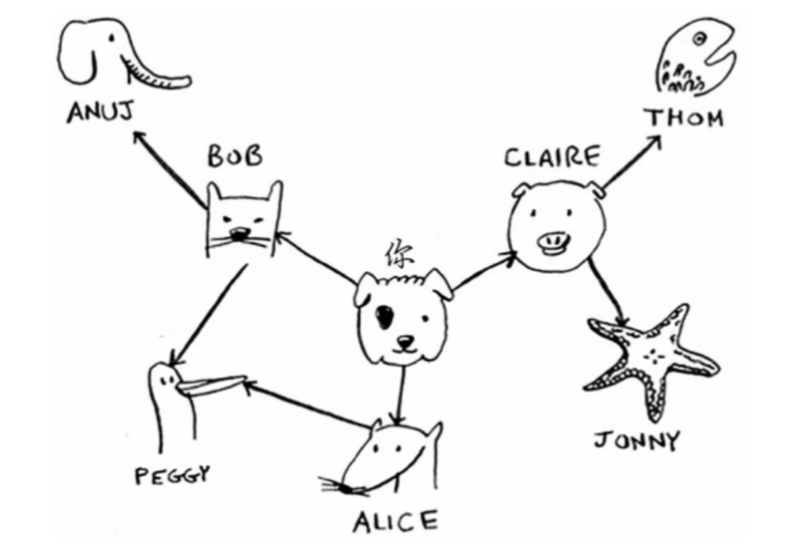

### 广度优先搜索
#### 问题类别
- 第一类问题：从节点A出发，有前往节点B的路径吗？
- 第二类问题：从节点A出发，前往节点B的哪条路径最短？
#### 问题描述
假设你经营着一个芒果农场，需要寻找芒果销售商，以便将芒果卖给他。在Facebook，你与芒果销售商有联系吗？为此，你可以在朋友中查找。

#### 问题建模
有前往节点B的路径吗？

#### 解题思路
1. 数字化图。
```
$graph = [
	'you' => [
		'Claire',
		'Alice',
		'Bob'
	],
	'Claire' => [
		'Thon',
		'Jonny'
	],
	'Alice' => [
		'Peggy'
	],
	'Bob' => [
		'Peggy',
		'Aunj'
	],
	'Aunj' => [],
	'Peggy' => [],
	'Thon' => [],
	'Jonny' => []
];
// 注意：最外环也要表示出来。并且最外环的值为空数组。

```