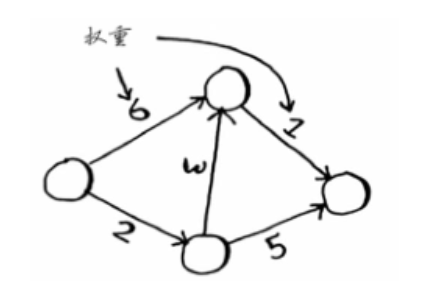
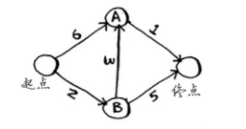
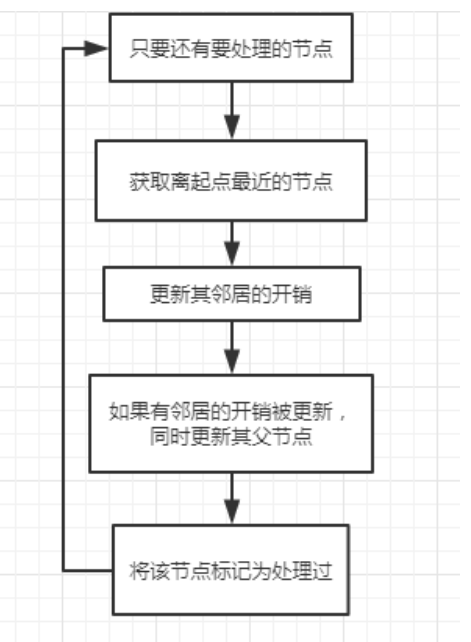

### 迪杰特斯拉
#### 适用条件
无环有向图，并且无负权边。
#### 问题描述
在图中找出从原点到终点的最短路径。

示例：
```
输入：无环有向无负权边的图。
输出：从起点到终点的最短路径。
```
#### 问题建模
原点到其余顶点的最短路径
（待写...）
#### 解题思路
1. 数字化图。
2. 找出开销最小的节点。
3. 遍历邻居。
4. 如果经当前节点前往该邻居更近：
    - 则更新该节点的开销。
    - 同时将该邻居节点的父节点设置为当前节点。
- 例题：

- 创建三个散列表来表示这张图。
```
$graph = [
    'start' => [
        'a' => 6,
        'b' => 3
    ],
    'a' => ['fin'=>1],
    'b' => [
        'a' => 3,
        'fin' => 5
    ],
    'fin' => []
];
$costs = [
    'a' => 6,
    'b' => 2,
    'fin' => 1000
];
$parent = [
    'a' => 'start',
    'b' => 'start',
    'fin' => null
];
```
1. 找到开销最便宜的节点。
2. 对于该节点的邻居，检查是否有前往它们的更短路径，如果有，就更新其开销。
3. 重复这个过程。
4. 计算最终路径。
```
function Dj($graph, $costs, $parent)
{
    $node = find_lowest_cost_node($costs);
    $processed = [];
    while (!is_null($node)) {
        // 1. 获取起点到当前节点的开销
        $cost = $costs[$node];
        // 2. 获取当前节点的所有邻居。
        $neighbors = $graph[$node];
        // 3. 遍历当前节点的所有邻居节点。
        foreach ($neighbors as $childNode => $childCost) {
            //4. 计算从起点到当前节点的子节点的花销。
            $new_childNode_cost = $cost + $childCost;
            //5. 判断
            if ($costs[$childNode]>$new_childNode_cost) {
                // 6. 更新节点开销
                $costs[$childNode] = $new_childNode_cost;
                // 7. 更新父节点。
                $parent[$childNode] = $node;
            }
        }
        $processed[] = $node;
        $node = find_lowest_cost_node($costs, $processed);
    }
    $result = [
        'fin_cost' => $costs['fin'],
        'route' => $parent
    ];
    return $result;
}
function find_lowest_cost_node($costs, $processed = [])
{
    $lowest_cost_node = null;
    $lowest_cost = 1000;
    foreach ($costs as $node => $cost) {
        if (!in_array($node, $processed)  && $cost < $lowest_cost) {
            $lowest_cost = $cost;
            $lowest_cost_node = $node;
        }
    }
    return $lowest_cost_node;
}
```
